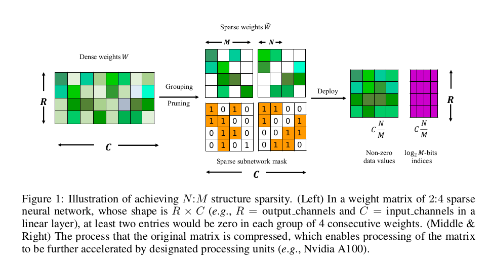
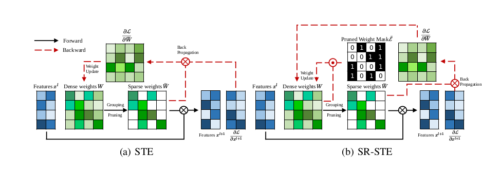

# N:M Fine-grained Structured Sparse Neural Networks

## Why N:M sparsity?

Sparse Networks is divided into structured sparsity and unstructured sparsity. Unstructured sparsity can remove network parameters at any position, which is called fine-grained sparsity. Unstructured sparseness can often achieve a higher sparsity ratio and maintain the accuracy of the model, but it is difficult to achieve speedup.

N:M sparsity is fine-grained structured network, which can maintain the advantages of both unstructured fine-grained sparsity and structured coarse-grained sparsity simultaneously.

Thus, latest NVIDIA Ampere design for 2:4 sparsity, this paper discuss a more general form of N:M sparse networks.





For hardware acceleration, you can see the following resources:

&nbsp; [How Sparsity Adds Umph to AI Inference](https://blogs.nvidia.com/blog/2020/05/14/sparsity-ai-inference/)

&nbsp; [Accelerating Sparsity in the NVIDIA Ampere Architecture](https://developer.download.nvidia.com/video/gputechconf/gtc/2020/presentations/s22085-accelerating-sparsity-in-the-nvidia-ampere-architecture%E2%80%8B.pdf)

&nbsp; [Exploiting NVIDIA Ampere Structured Sparsity with cuSPARSELt](https://developer.nvidia.com/blog/exploiting-ampere-structured-sparsity-with-cusparselt/) 


## Method

SR-STE can achieve **comparable or even better** results with **negligible extra training cost** and **only a single easy-to-tune hyperparameter $\lambda_w$** than original dense models.




the implementation details are shown as follows(in https://github.com/NM-sparsity/NM-sparsity/blob/main/devkit/sparse_ops/sparse_ops.py):

```python

class Sparse(autograd.Function):
    """" Prune the unimprotant weight for the forwards phase but pass the gradient to dense weight using SR-STE in the backwards phase"""

    @staticmethod
    def forward(ctx, weight, N, M, decay = 0.0002):
        ctx.save_for_backward(weight)

        output = weight.clone()
        length = weight.numel()
        group = int(length/M)

        weight_temp = weight.detach().abs().reshape(group, M)
        index = torch.argsort(weight_temp, dim=1)[:, :int(M-N)]

        w_b = torch.ones(weight_temp.shape, device=weight_temp.device)
        w_b = w_b.scatter_(dim=1, index=index, value=0).reshape(weight.shape)
        ctx.mask = w_b
        ctx.decay = decay

        return output*w_b


    @staticmethod
    def backward(ctx, grad_output):

        weight, = ctx.saved_tensors
        return grad_output + ctx.decay * (1-ctx.mask) * weight, None, None

```
## Experiments

#### Image Classification on ImageNet 

 [classification](https://github.com/anonymous-NM-sparsity/NM-sparsity/tree/main/classification) 


#### Objection Detection on COCO


 [detection](https://github.com/anonymous-NM-sparsity/NM-sparsity/tree/main/detection) 

#### Instance Segmentation on COCO

 [segmentation](https://github.com/anonymous-NM-sparsity/NM-sparsity/tree/main/classification) 

#### Machine Translation


 [language model](https://github.com/anonymous-NM-sparsity/NM-sparsity/tree/main/classification) 


#### Citing 

If you find NM-sparsity and SR-STE useful in your research, please consider citing:

        @inproceedings{zhou2021,
        title={Learning N:M Fine-grained Structured Sparse Neural Networks From Scratch},
        author={Aojun Zhou, Yukun Ma, Junnan Zhu, Jianbo Liu, Zhijie Zhang, Kun Yuan, Wenxiu Sun, Hongsheng Li},
        booktitle={International Conference on Learning Representations},
        year={2021},
        }
